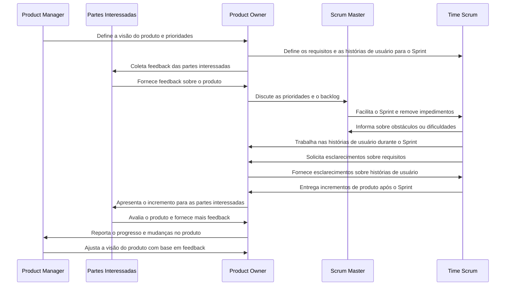

# Wiki2mkdocs

## Go Wiki MkDocs
Dado a url do repositório da Wiki, este será clonado e os arquivos sanetizados seguindo uma estrutura padrão.
Este projeto é uma aplicação em Go que clona um repositório wiki do GitHub e inicializa um projeto MkDocs. 
A aplicação organiza os arquivos baixados em um formato adequado para documentação.

## Funcionalidades
- Clonagem de repositórios wiki.
- Conversão de nomes de arquivos para letras minúsculas.
- Garantia de codificação em UTF-8 para todos os arquivos.
- Organização de imagens em um diretório específico (`docs/img`).
- Geração automática do arquivo `mkdocs.yml` com a estrutura de navegação da Wiki.

## Estrutura do Projeto

```
go-wiki-mkdocs
├── src
│   ├── main.go          # Ponto de entrada da aplicação
│   ├── utils
│   │   └── file_utils.go # Funções utilitárias para manipulação de arquivos
│   └── github
│       └── clone.go     # Lógica para clonar o repositório wiki
├── go.mod               # Módulo de configuração do Go
├── go.sum               # Somas de verificação das dependências
└── README.md            # Documentação do projeto
```

## Como Executar

1. Certifique-se de ter o Go instalado em sua máquina.
2. Clone este repositório.
3. Navegue até o diretório do projeto.
4. Execute o comando:

   ```
   go run src/main.go <URL_DO_REPOSITORIO_WIKI>
   ```

Substitua `<URL_DO_REPOSITORIO_WIKI>` pelo endereço do repositório wiki que deseja clonar.


    
## Contribuições

Contribuições são bem-vindas! Sinta-se à vontade para abrir issues ou pull requests.
