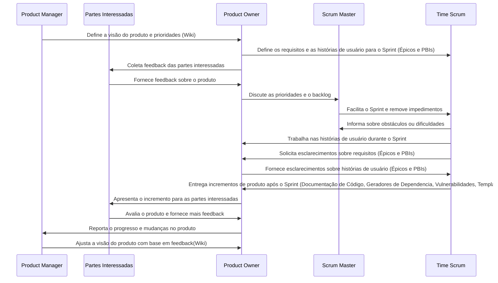

# wiki2mkdocs
Efetua a transformação de um repositório Wiki mantido pelo Product Manager, Owner e Equipe de Desenvolvimento.

## Objetivo
No cenário de desenvolvimento ágil e de constante inovação tecnológica, a relação entre o código e documentação para o usuário e desenvolvedores — é frequentemente considerada um ponto crítico. Em uma análise simples, podemos adotar boas práticas de desenvolvimento e da documentação, sendo possível evitar essa defasagem, mantendo a documentação sempre alinhada com as alterações.

As aplicações e documentações, quando mantidas de acordo com padrões e processos adequados, não apresentam defasagem em seu conteúdo e de suas alterações.

Este processo visa buiscar as atualizações realizadas em diversos projetos e unifica-las em um Portifólio único institucional.

## Visão da Documentação Contínua e Acompanhamento Ágil¶
A documentação de software deve ser tratada de forma contínua e DaC (Documentation as Code) e não como uma atividade pontual após o desenvolvimento do código.

Ao longo do ciclo de vida de um projeto, a documentação (tanto técnica quanto voltada para o usuário) deve ser constantemente atualizada, paralelamente ao progresso do desenvolvimento da aplicação.

A documentação "viva" é atualizada com a mesma frequência do código, garantindo que os engenheiros, gestores de qualidade e até mesmo os usuários, tenham acesso a informações precisas, em tempo real.

Em nossa abordagem, trateremos de uma documentação contínua, que inclui:

- [x] Documentação de Código (Javadoc, Docstrings, JSDOC, PLDoc, RDoc,PHPDoc + phpDocumentor, GoDoc, Rustdoc);
- [x] Commit Conventional (Comentários explicativos);
- [x] Testes e cobertura de testes;
- [x] Documentação de APIs (OAS, Swagger ou ReDoc);
- [x] Geradores de Dependencia e Vulnerabilidades;
- [x] Preenchimento de Templates durante o processo de Pull-Request e documentação de releases;
- [x] Wiki apenas o manual de operação da Aplicação.

### Origem das Informações

#### Wiki
- [x] Planejamento do Projeto;
- [x] Documentação do usuário final orientada a processos;
- [x] Manual de Utilização do Produto

#### Documentação técnica para manutenção;
- [x] Pull Request/Code Review efetuará a geração de chagelogs e republicação do Portifólio;
- [x] Geração do Report Book;
- [x] Geração de Catálogo de APIs por grupo;
      - [x] Documentação de APIs (OAS, Swagger ou ReDoc);

## Funcionalidades
- Clonagem de repositórios wiki.
- Conversão de nomes de arquivos para letras minúsculas.
- Garantia de codificação em UTF-8 para todos os arquivos.
- Organização de imagens em um diretório específico (`docs/img`).
- Geração automática do arquivo `mkdocs.yml` com a estrutura de navegação da Wiki.

## Responsabilidades

    
## Contribuições

Contribuições são bem-vindas! Sinta-se à vontade para abrir issues ou pull requests.
