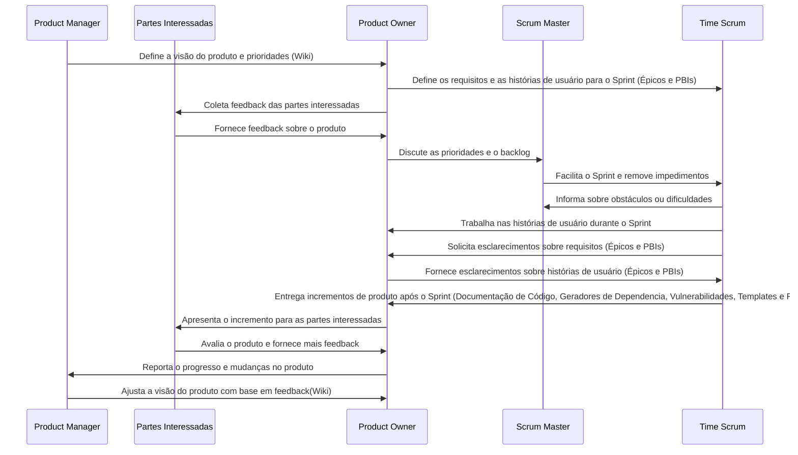
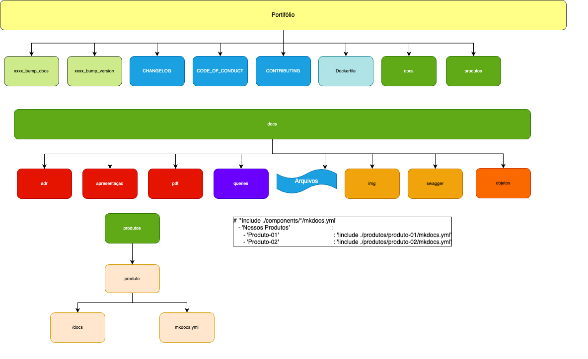

# wiki2mkdocs
Efetua a transformação de um repositório Wiki mantido pelo Product Manager, Owner e Equipe de Desenvolvimento.

## Objetivo
No cenário de desenvolvimento ágil e de constante inovação tecnológica, a relação entre o código e documentação para o usuário e desenvolvedores — é frequentemente considerada um ponto crítico. Em uma análise simples, podemos adotar boas práticas de desenvolvimento e da documentação, sendo possível evitar essa defasagem, mantendo a documentação sempre alinhada com as alterações.

As aplicações e documentações, quando mantidas de acordo com padrões e processos adequados, não apresentam defasagem em seu conteúdo e de suas alterações.

Este processo visa buiscar as atualizações realizadas em diversos projetos e unifica-las em um Portifólio único institucional.

## Visão da Documentação Contínua e Acompanhamento Ágil¶
A documentação de software deve ser tratada de forma contínua e DaC (Documentation as Code) e não como uma atividade pontual após o desenvolvimento do código.

Ao longo do ciclo de vida de um projeto, a documentação (tanto técnica quanto voltada para o usuário) deve ser constantemente atualizada, paralelamente ao progresso do desenvolvimento da aplicação.

A documentação "viva" é atualizada com a mesma frequência do código, garantindo que os engenheiros, gestores de qualidade e até mesmo os usuários, tenham acesso a informações precisas, em tempo real.

Em nossa abordagem, trateremos de uma documentação contínua, que inclui:

- [x] Documentação de Código (Javadoc, Docstrings, JSDOC, PLDoc, RDoc,PHPDoc + phpDocumentor, GoDoc, Rustdoc);
- [x] Commit Conventional (Comentários explicativos);
- [x] Testes e cobertura de testes;
- [x] Documentação de APIs (OAS, Swagger ou ReDoc);
- [x] Geradores de Dependencia e Vulnerabilidades;
- [x] Preenchimento de Templates durante o processo de Pull-Request e documentação de releases;
- [x] Wiki apenas o manual de operação da Aplicação.

### Origem das Informações

#### Wiki
- [x] Planejamento do Projeto;
- [x] Documentação do usuário final orientada a processos;
- [x] Manual de Utilização do Produto

#### Documentação técnica para manutenção;
- [x] Pull Request/Code Review efetuará a geração de chagelogs e republicação do Portifólio;
- [x] Geração do Report Book;
- [x] Geração de Catálogo de APIs por grupo;
   - [x] Documentação de APIs (OAS, Swagger ou ReDoc);

## Funcionalidades
- Clonagem de repositórios wiki.
- Conversão de nomes de arquivos para letras minúsculas.
- Garantia de codificação em UTF-8 para todos os arquivos.
- Organização de imagens em um diretório específico (`docs/img`).
- Geração automática do arquivo `mkdocs.yml` com a estrutura de navegação da Wiki.

## Responsabilidades



# Procedimento de Instalação
Este processo esta em desenvolvimento o que acarreta em um processo muito manual e em breve estaremos automatizando.
## Instalação do Compilador GOLANG
As instruções oficiais de instalação do Go estão disponíveis [Site Oficial](http://www.golangbr.org/doc/instalacao).
### Mac OSX
O processo de instalação é bem simples. Primeiro, o que você precisa fazer é executar o comando abaixo pra instalar o homebrew (brew). O Brew depende do Xcode, então você deve se certificar de instalá-lo primeiro.

```xcode-select --install```

Depois, execute o comando a seguir para instalar o homebrew:

```/usr/bin/ruby -e "$(curl -fsSL https://raw.githubusercontent.com/Homebrew/install/master/install)"```

Agora você consegue instalar o Go:
```brew install go```

Siga todas as instruções recomendadas pelo seu gerenciador de pacotes. Nota cada grupo de instruções varia de sistema operacional para sistema operacional. Agora verifique a instalação:
```
$ go version
go version go1.23.2 darwin/arm64
```

### Windows
Faça download da versão que você deseja instalar, no [Site](https://go.dev/dl/),. Recomendo a instalação sempre a versão mais atual.

Abra o arquivo MSI e siga os passos da instalação. Por padrão o instalador adiciona o Go na pasta C:\Go.

O instalador adiciona o caminho C:\Go\bin na variável de ambiente "Path" e cria a variável de usuário "GOPATH" com o caminho C:\Users\%USER%\go.

## Instalação do Produto
Como estamos em fase de desenvolvimento, todo o processo por enquanto é manual, bastando você seguir os passos.

```
git clone https://github.dev/60pportunities/wiki2mkdocs
cd wiki2mkdocs
go env GOOS GOARCH (Lista a Arquitetura e o Sistema Operacional)
go tool dist list  (Lista as Arquiteturas e os Sistemas Operacionais que o go tem disponível)

Criação da Rotina em Mac OSX
Caso não haja a necessidade em criar um executável em uma arquitetura diferente efetue:\
go build .
Será gerado um : wiki-to-mkdocs

Caso haja a necessidade em um Sistema Mac OSX para Windows, execute:
GOOS=windows go build .
Será gerado um : wiki-to-mkdocs.exe
```
## Geração da Documentação
Dentro do repositório há um arquivo de `portifolio.json` onde teremos o portifólio de documentação dos sistemas.

```
[
  {
    "nome_produto": "01-Exemplo",
    "url_repositorio": "https://github.com/horaciovasconcellos/01-exemplo.wiki.git",
    "gerar_documentacao": "Y"
  },
  {
    "nome_produto": "02-Exemplo2",
    "url_repositorio": "https://github.com/horaciovasconcellos/02-exemplo.wiki.gitB",
    "gerar_documentacao": "N"
  }
]
```
## Imagem



## Contribuições

Contribuições são bem-vindas! Sinta-se à vontade para abrir issues ou pull requests.
